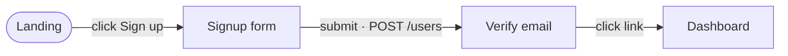

# /hp — happy path

Draw the **minimum viable diagram (MVD)**: the one success spine of a user
journey, before any code exists. `/trace` reads built code inward; `/hp` draws
the intended flow outward.

**Core discipline: one success spine, nothing else.** The happy path is the path
where everything goes right. No error branches, no edge cases, no alternate
flows — tempted to add a failure fork → stop; that belongs in the build, not the
MVD.

## When to use

- New idea, no codebase yet, want a shared picture of the golden journey.
- Seeding a PRD / spec with a concrete flow (the `/preset init` funnel calls
  `/hp` for exactly this).
- "What does the user actually do, start to finish, when it works?"

Not for existing code — that is `/trace`. Not a grill — heavy interrogation is
`/grill-me`'s job; `/hp` draws fast on what is known.

## Steps

1. **Capture the idea.** Argument → that is the idea. Bare `/hp` → ask one line:
   "What're you building?"
2. **Clarify only if thin.** At most 1–2 crisp questions — who is the actor, what
   is the one core action. Idea already clear → skip straight to drawing. MVD
   means *minimum*; do not interrogate.
3. **Ask how to convey it.** One question, four modes:

   | Mode | Node = | Edge = |
   |---|---|---|
   | **ux+beat** (default) | screen/state the user sees | user action + the one system thing behind it (`submit · POST /users`) |
   | **ux** | screen/state | user action |
   | **system** | component/service/store | call/data |
   | **beats** | — | numbered prose steps, light boxes or none |

4. **Draw the spine.** Success path only, enter → exit. Box modes → Mermaid
   `flowchart`; beats → numbered list. Smallest diagram that conveys the journey
   — hit the beats that matter, skip the obvious plumbing.
5. **Persist.** Write `.context/happy-path.md` (create `.context/` if missing).
   One `##` section per flow — a second actor or goal is a second section, never
   a fork in the first.

## Output format — `.context/happy-path.md`

````markdown
---
type: happy-path
project: <name>
updated: <date>
tags: [happy-path, mvd]
---
# Happy Paths (MVD)

## <flow name>
- **Idea:** <one line>  **Mode:** <ux+beat|ux|system|beats>  **Actor:** <who>  **Goal:** <success outcome>
- **Updated:** <date>


````

If `.context/overview.md` exists, add `[[happy-path]]` to its Map section once.

## Red flags — stop and correct

- Diagram has an error or failure branch → delete it; the happy path is
  success-only.
- More than ~2 clarifying questions → you are grilling, not drawing. Draw with
  what you have and note the assumptions.
- Every screen enumerated → that is the build, not the MVD; keep the beats that
  carry the journey.
- Flow drawn but `.context/happy-path.md` not written → the next session redraws
  from scratch.

## Pairs with

- `/trace` — once built, trace the real flow and compare to this MVD for drift.
  Design-time vs built-time, side by side in `.context/`.
- `/preset init` — draws the MVD after the grill, embeds it in the PRD.
